# CentOS 7.1 1503 Installation Procedure


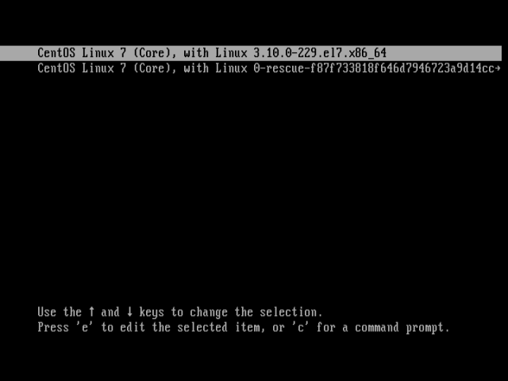

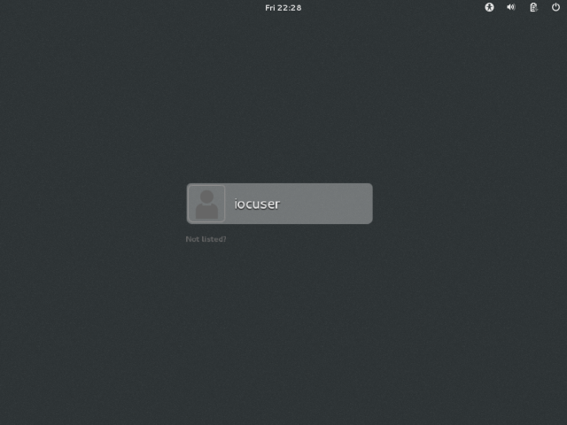

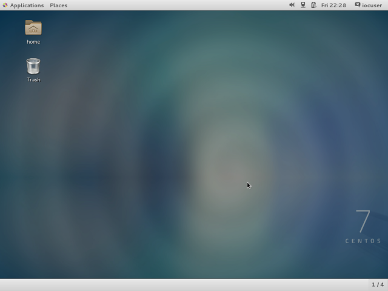

# Development Machine Setup Procedure
* Version : 2.2.4
* Selected Option (TRUE) : EEE Local installation / CS-Studio 
* Unselected Option (FALSE) : ESS Active Directory service / OpenXAL / IPython 

## Download the script 
```
curl -L https://git.io/vi8DA -o dm_setup.bash
```
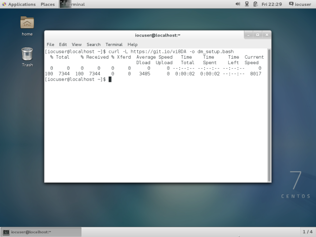


## Run the script
```
bash em_setup.script
```
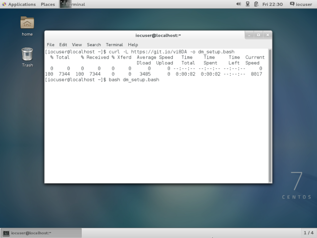

## sudo permission
* Type the user password here.

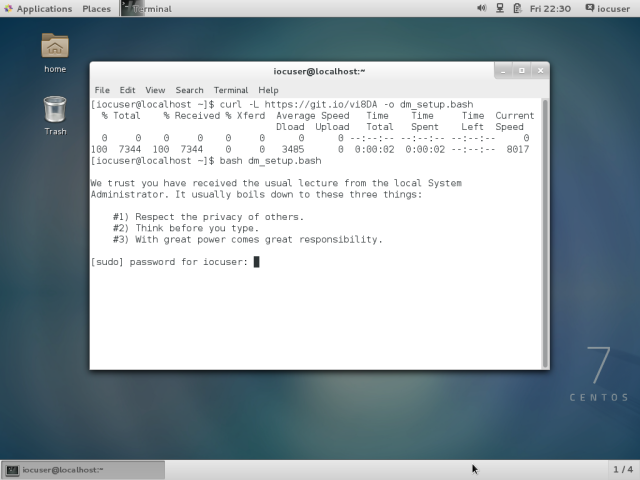

## Installation is started
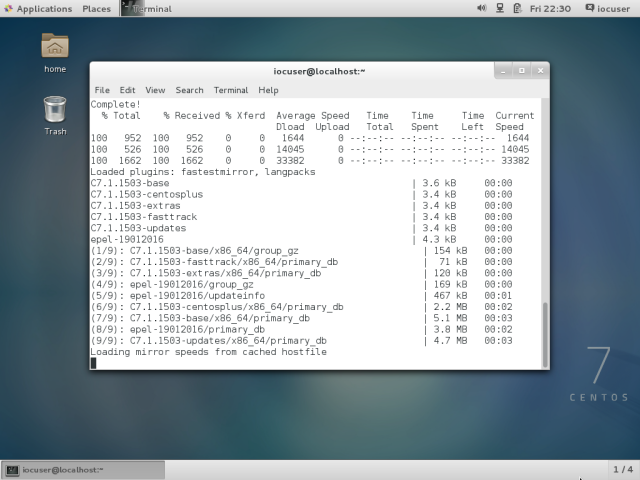

## Select the release version 
* Please see the following site for more information.
https://ess-ics.atlassian.net/wiki/x/MoL-Ag


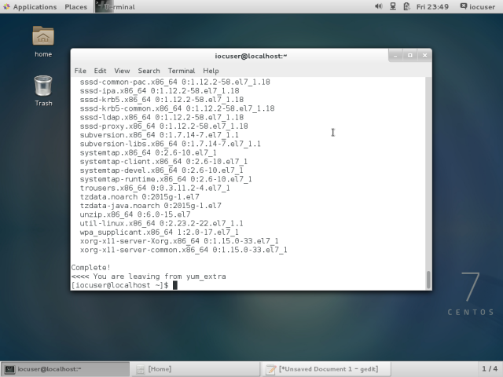

## Run the SoftIOC via iocsh
* Open another terminal
* type iocsh
```
iocsh
```
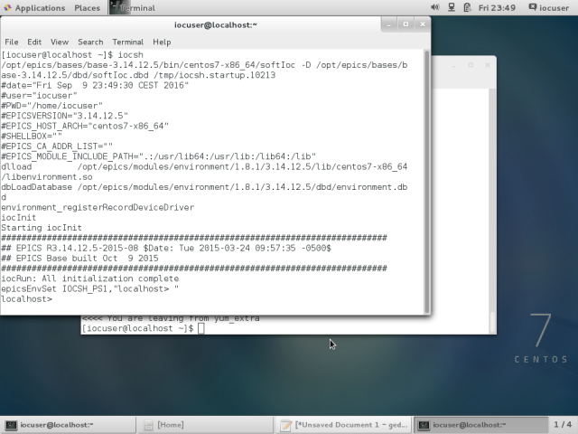

## Run CS-Studio 
```
css
```

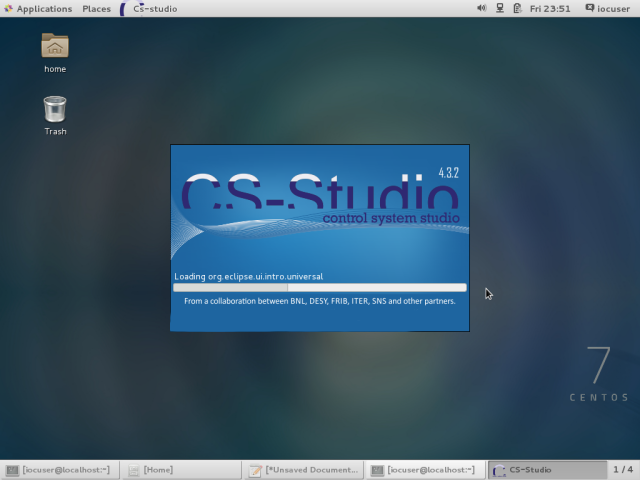

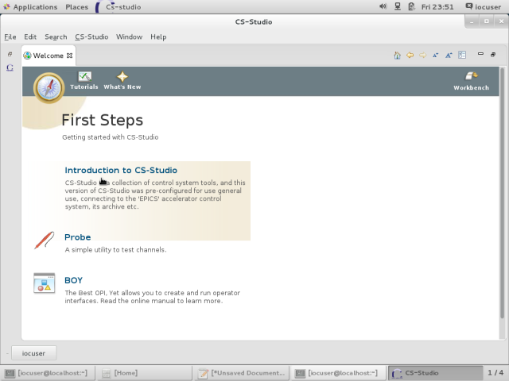


## Error 
* the following error was solved from 2.2.5
A race condition error solved for local EEE machines, where requireExecCompletions is referenced in playbooks before it has been synced.

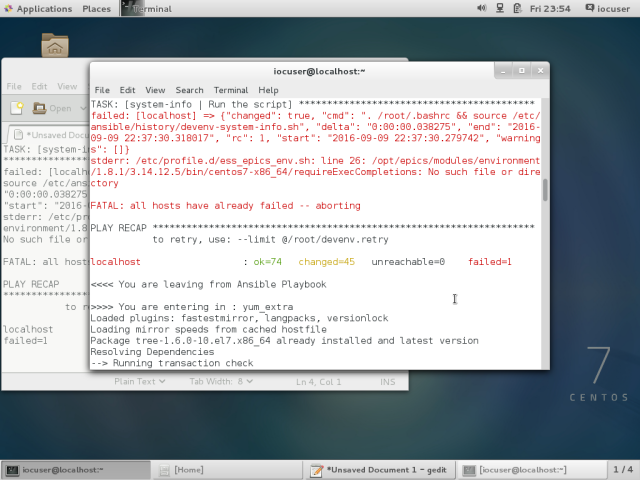
